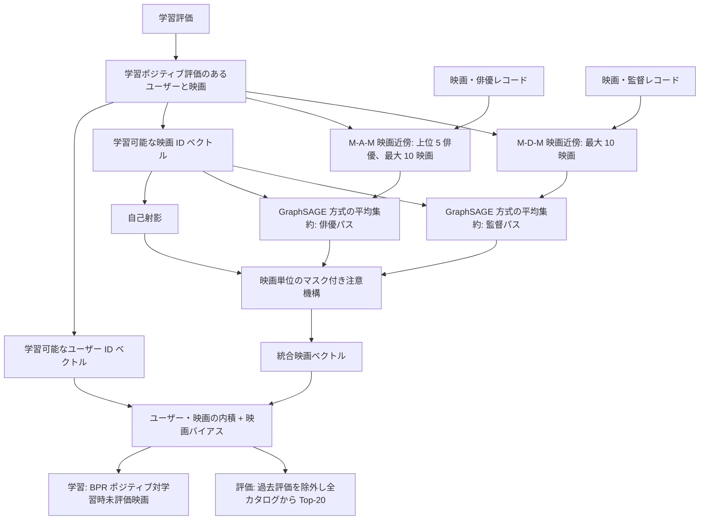

# 共有する俳優・監督情報を用いた HetRec 映画推薦

[](https://github.com/zhuoqun-xu/hetrec-graph-recommender/actions/workflows/ci.yml)
[](https://www.python.org/)
[](LICENSE)

[简体中文](README.zh-CN.md) · [English](README.md) · 日本語

本リポジトリは、**2021年の学士論文**で検討した異種グラフ表現のアイデアを、Top-20映画推薦の実験として実装したものです。実行可能なコード、評価設定、実験結果を収録しています。

[研究概要](PROJECT_ABSTRACT.md)

## 研究課題

評価履歴からはユーザーがどの映画を好んだかが分かります。俳優や監督の情報も手掛かりになります。たとえば、視聴者の重なりが少ない映画同士でも、同じ監督が関わっている場合があります。こうした関係を加えることで推薦性能が向上するかを検証します。

評価は二つの方法で行います。第一に、評価履歴のみを使う人気度ベース、ユーザーベース協調フィルタリング、行列分解とグラフモデルを比較します。第二に、俳優・監督リンクをランダムにシャッフルし、**同じグラフモデル**を再学習します。実際のリンクが有用であれば、少なくともシャッフルしたリンクを上回るはずです。このバージョンでは、その優位性は確認できませんでした。

## データと評価

データセットは [HetRec 2011 MovieLens-2k v2](https://files.grouplens.org/datasets/hetrec2011/hetrec2011-movielens-2k-v2.zip) です。映画の評価に加え、俳優、監督、ジャンルなどのメタデータを含みます。本モデルでは評価、映画、俳優、監督のファイルを使用します。データを各自でダウンロードし、リポジトリの外に展開してください。データセットの [README](https://files.grouplens.org/datasets/hetrec2011/hetrec2011-movielens-readme.txt) には**非商用利用**の条件があります。生データは本リポジトリに含まれていません。

本リポジトリの MIT ライセンスはソースコードとプロジェクト文書にのみ適用されます。HetRec データセットや第三者の論文・資料の利用権を与えるものではありません。詳しくは[データのライセンス](DATA_LICENSE.md)を参照してください。

評価履歴を時刻順に全体で分割し、学習 80%、検証 10%、テスト 10% とします。星 4 以上の評価をポジティブとみなします。学習データにポジティブ評価があるユーザーと映画のみを評価対象とします。ランキング時には候補カタログ全体をスコアリングし、少数の候補をサンプリングしません。過去にユーザーが評価した映画は、評価が低くても候補から除外します。各ユーザーについて Recall@20 と NDCG@20 を計算し、ユーザー間で平均します。

一部の評価時刻は、データセット記載の映画公開年より前です。以下の結果では[時刻異常プロトコル](06_时间异常敏感性协议_2026-09-15.md)を使用します。元の分割境界を保ち、**学習評価のみ**から矛盾のある映画 376 件を特定して、学習・検証・テストの全分割から除外します。未フィルタ版を実行するには、実行コマンドからクリーニング用フラグを外してください。

評価履歴のみを使うベースラインは、人気度ベース、近傍数 50 のユーザーベース協調フィルタリング、BPR 行列分解です。さらに、リンクをシャッフルしたグラフ、関係パスなし、俳優リンクのみ、監督リンクのみ、学習型ではなく均等な注意重みを使うグラフモデルも評価します。シャッフルでは、各映画の近傍数とサンプリング先として選ばれる頻度を保ちながら、**どの映画同士がリンクするか**を変更します。学習条件はそれ以外すべて同一です。学習エポック数は検証データで選択し、グラフモデルのテスト結果はシード 42、43、44 の平均です。

## モデルの仕組み

異種関係は `user–rating–movie–actor/director–person` です。モデルは映画側の二つのパス `movie–actor–movie` と `movie–director–movie` をたどります。たとえば、同じ監督を持つ映画は監督パス上の近傍となります。映画–ジャンル–映画のパスはこのバージョンでは密度が高すぎるため使用しません。

1. 候補映画と学習ユーザーにはそれぞれ学習可能な ID ベクトルを割り当てます。俳優については、映画ごとに順位上位 5 名のみを残します。各パスで候補映画から最大 10 件の近傍をサンプリングし、同一シード内ではサンプルを固定します。
2. 俳優近傍と監督近傍を別々に平均します。それぞれの平均を現在の映画ベクトルと結合し、関係ごとの分岐表現に変換します。近傍のない映画もスコアリングできるよう、自己分岐も設けます。
3. 注意機構が映画ごとに利用可能な自己・俳優・監督の各分岐へ重みを付けます。ユーザーと映画の内積に映画バイアスを加えて推薦スコアを求めます。
4. 学習中の星 4 以上の評価ごとに、ユーザーが学習データで評価していない映画を 1 件サンプリングします。BPR 損失により、ポジティブ映画の順位が高くなるよう学習します。未評価映画は学習サンプルであり、既知の嫌いな映画ではありません。

本手法は GraphSAGE 方式の平均集約と HAN 方式のパス融合を応用しています。ユーザーと映画には学習済み ID ベクトルがあるため、評価対象は学習時に観測済みのユーザーと映画です。俳優と監督はリンク定義に使い、独自の学習可能なノードベクトルは持ちません。推薦スコアと BPR 学習目的は本タスク向けの追加要素です。

## モデル構成

図では二つの映画メタパスと学習済みユーザー・映画ベクトルを分けて示しています。俳優・監督レコードが映画の近傍を定義し、注意層がランキング前に映画の各分岐を統合します。



## アルゴリズムの詳細

俳優または監督のパス $p$ に沿った映画 $m$ のサンプリング済み近傍を $S_p(m)$、学習可能な ID ベクトルを $e_m$ とします。自己分岐と、近傍が空でない関係分岐は次のように計算します。

$$h_{m,\mathrm{self}}=\operatorname{L2Norm}(\operatorname{ReLU}(W_{\mathrm{self}}e_m+b_{\mathrm{self}})),$$

$$\bar e_{m,p}=\frac{1}{|S_p(m)|}\sum_{n\in S_p(m)}e_n,\qquad h_{m,p}=\operatorname{L2Norm}(\operatorname{ReLU}(W_p[e_m\,\|\,\bar e_{m,p}]+b_p)).$$

小規模な注意ネットワークで、映画ごとに自己・俳優・監督の各分岐をスコアリングします: $a_{m,p}=w^{\mathsf T}\tanh(W_a h_{m,p}+b_a)+c_a$。利用可能な分岐上で softmax を取り $\alpha_{m,p}$ とし、$z_m=\sum_p\alpha_{m,p}h_{m,p}$、$s(u,m)=e_u^{\mathsf T}z_m+c_m$ とします。注意機構が重み付けするのは近傍個々ではなく分岐です。

ポジティブな組 $(u,m^+)$ とサンプリングした未評価候補 $m^-$ に対する学習損失は次のとおりです。

$$L=\frac{1}{|D|}\sum_{(u,m^+,m^-)\in D}\operatorname{softplus}(s(u,m^-)-s(u,m^+)).$$

コード構成: [データ分割と評価器](data_protocol.py) → [関係のサンプリング](graph_data.py) → [映画エンコーダーとスコアリング](meta_path_model.py) → [学習と比較実験](run_meta_path_recommender.py)。

## ローカルでの実行

Python 3.11 以降が必要です。\`python3 --version\` で正しい Python が参照されていることを確認してください。\`/path/to/hetrec2011-movielens-2k-v2\` はデータセットを展開したディレクトリに置き換えます。以下は macOS/Linux 向けの仮想環境コマンドです。

```sh
python3 -m venv .venv
.venv/bin/python -m pip install -r requirements.txt
.venv/bin/python -B -m unittest discover -v
.venv/bin/python -B run_popularity_baseline.py /path/to/hetrec2011-movielens-2k-v2 --exclude-train-year-contradictions
.venv/bin/python -B run_user_cf_baseline.py /path/to/hetrec2011-movielens-2k-v2 --exclude-train-year-contradictions
.venv/bin/python -B run_bpr_mf_baseline.py /path/to/hetrec2011-movielens-2k-v2 --exclude-train-year-contradictions
.venv/bin/python -B run_meta_path_recommender.py /path/to/hetrec2011-movielens-2k-v2 --exclude-train-year-contradictions
```

各実行スクリプトは JSON サマリーを出力します。未フィルタ版を実行するには `--exclude-train-year-contradictions` を外してください。動作確認済みの環境は Python 3.12.14、NumPy 2.3.5、pandas 2.2.3、PyTorch 2.14.0 です。グラフモデルと内部バリアント 5 種を 3 シードで実行した場合、CPU で約 **358 秒**かかりました。ピークメモリは測定していません。

同じコマンドは `make` からも実行できます。例:

```sh
make test
make audit DATA_DIR=/path/to/hetrec2011-movielens-2k-v2
make experiment DATA_DIR=/path/to/hetrec2011-movielens-2k-v2
```

`make experiment` はクリーニング済みデータに対する 3 種のベースラインを実行した後、グラフ実験を行います。結果を標準出力に表示し、元データセットのコピーや変更は行いません。

## 結果

クリーニング後のテストセットには、評価対象ユーザー **522 人**、ポジティブ評価 **6,609 件**、候補映画 **7,498 件**が含まれます。グラフモデルと BPR-MF の値は 3 シードの平均です。Recall@20 は後にユーザーが好んだ映画が Top-20 に何件含まれたかを数え、NDCG@20 はその順位も考慮します。

| 手法 | Recall@20 | NDCG@20 |
| --- | ---: | ---: |
| 人気度ベース | 0.099504 | 0.094369 |
| ユーザーベース協調フィルタリング | **0.115075** | **0.114766** |
| BPR 行列分解 | 0.095110 | 0.097202 |
| 実際の俳優 + 監督グラフ | 0.088159 | 0.088704 |
| 接続先をシャッフルしたグラフ（予算を一致） | 0.091457 | 0.092014 |

この結果ではユーザーベース協調フィルタリングが最も高いスコアでした。実際の俳優・監督グラフはシャッフルしたグラフをわずかに下回っています。現在のグラフ構成と融合方法では、これらの関係による改善は確認できませんでした。BPR-MF はエポック数が少なく、学習予算はグラフモデルと完全には一致していません。

グラフモデルは当初短い学習スケジュールで実行され、そのテストスコアを確認した後に学習を延長しました。そのため、この表のグラフの数値は新たなブラインドテストではなく、追加探索の結果です。シード別スコア、パスのアブレーション、データクリーニング規則については[時刻異常プロトコル](06_时间异常敏感性协议_2026-09-15.md)と[実験の詳細レポート](07_异构图实现与实验结果_2026-09-15.md)を参照してください。

## 参考論文

- Hamilton, Ying and Leskovec (2017), [*Inductive Representation Learning on Large Graphs*](https://arxiv.org/abs/1706.02216): サンプリング近傍の平均集約 (GraphSAGE)。
- Wang et al. (2019), [*Heterogeneous Graph Attention Network*](https://arxiv.org/abs/1903.07293): 異種グラフにおけるメタパス融合 (HAN)。
- Rendle et al. (2009), [*BPR: Bayesian Personalized Ranking from Implicit Feedback*](https://www.auai.org/uai2009/papers/UAI2009_0139_48141db02b9f0b02bc7158819ebfa2c7.pdf): ペアワイズランキング損失。
- Wang et al. (2019), [*Knowledge Graph Convolutional Networks for Recommender Systems*](https://arxiv.org/abs/1904.12575): 推薦におけるアイテム側の関係を扱う関連研究。
- Ji et al. (2023), [*A Critical Study on Data Leakage in Recommender System Offline Evaluation*](https://arxiv.org/abs/2010.11060): オフライン推薦評価における時系列分割とリーク。
- Harper and Konstan (2015), [*The MovieLens Datasets: History and Context*](https://files.grouplens.org/papers/harper-tiis2015.pdf)、および Cantador, Brusilovsky and Kuflik (2011), [*Second Workshop on Information Heterogeneity and Fusion in Recommender Systems (HetRec2011)*](https://doi.org/10.1145/2043932.2044016): MovieLens と HetRec の背景。

## 制限事項

映画メタデータの一部は評価時刻より後に集められた可能性があります。公開年との矛盾を除外しても、時間に関する問題をすべて解消できるわけではありません。俳優と監督は映画間リンクの定義にのみ使い、学習可能なノードベクトルは持ちません。各パスの近傍サンプルは最大 10 件で、監督リンクは疎です。本モデルは学習時に観測済みのユーザーと映画を対象としており、新規ユーザーや新規映画用の ID ベクトルはありません。BPR-MF の学習予算は短く、実験は単一の時系列分割と 3 シードで行っています。

