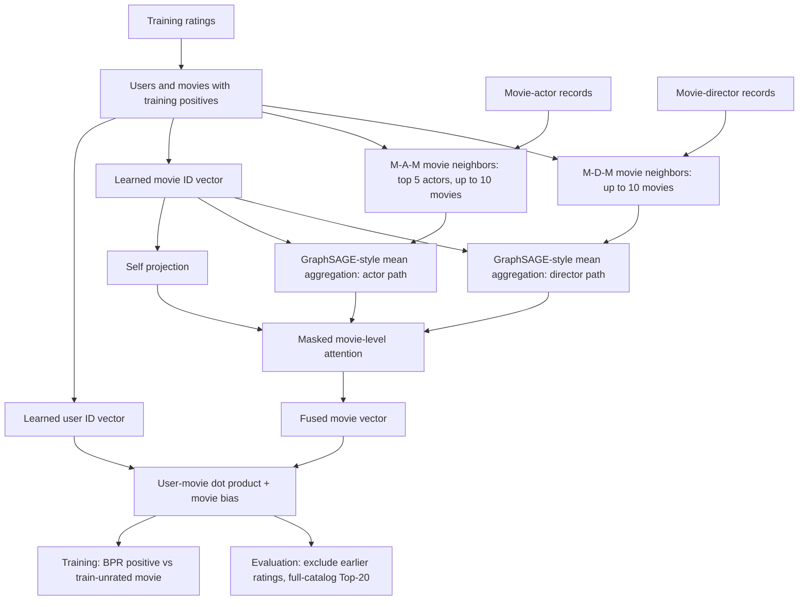

# HetRec movie recommendations from shared actors and directors

[](https://github.com/zhuoqun-xu/hetrec-graph-recommender/actions/workflows/ci.yml)
[](https://www.python.org/)
[](LICENSE)

[简体中文](README.zh-CN.md) · English

I turned a heterogeneous-graph representation idea from my **2021 undergraduate thesis** into a Top-20 movie recommendation experiment. This repository has the runnable code, evaluation setup and results.

[Research abstract](PROJECT_ABSTRACT.md)

## Research question

Ratings tell us which movies a user liked. Actors and directors offer another clue: two movies may share a director even when they have few viewers in common. The question here is whether adding those links improves recommendations.

I check this in two ways. First, I compare the graph model with popularity, user-based collaborative filtering and matrix factorization, which use ratings alone. Second, I randomly shuffle the actor/director links and train the **same graph model** again. If the real links are useful, they should at least outperform shuffled ones. This version did not show that advantage.

## Data and evaluation

The dataset is [HetRec 2011 MovieLens-2k v2](https://files.grouplens.org/datasets/hetrec2011/hetrec2011-movielens-2k-v2.zip). Alongside movie ratings, it includes actors, directors, genres and other metadata. This model reads the ratings, movies, actors and directors files. Download the data yourself and extract it outside the repository. The dataset [README](https://files.grouplens.org/datasets/hetrec2011/hetrec2011-movielens-readme.txt) sets **non-commercial use** conditions; raw data is not included here.

The MIT license in this repository applies to the source code and project documentation only. It does not grant rights to the HetRec dataset or third-party papers and resources; see [data licensing](DATA_LICENSE.md).

Ratings are split globally by timestamp into 80% train, 10% validation and 10% test. A rating of at least four stars counts as positive. This experiment evaluates only users with a training positive and movies with a training positive. At ranking time, the model scores the full candidate catalog, not a small set of sampled candidates. Movies the user already rated are removed even if the rating was low. Recall@20 and NDCG@20 are calculated for each user, then averaged across users.

Some rating timestamps are earlier than the movie years listed in the dataset. The results below use a [time-anomaly protocol](06_时间异常敏感性协议_2026-09-15.md): keep the original split boundaries, identify 376 conflicting movies using **training ratings only**, and remove them from all three partitions. Remove the cleaning flag in the run commands to see the unfiltered version.

The rating-only baselines are popularity, 50-neighbor user-based collaborative filtering and BPR matrix factorization. I also test the graph model with shuffled links, no relation paths, actor-only links, director-only links and equal rather than learned attention weights. Shuffling keeps each movie's neighbor count and how often each destination is sampled, but changes **which movies are linked**. Everything else in training stays the same. Training length is selected on validation; graph test results are averaged over seeds 42, 43 and 44.

## How the model works

The heterogeneous relations are `user–rating–movie–actor/director–person`. The model follows two movie-side paths: `movie–actor–movie` and `movie–director–movie`. Movies sharing a director, for example, become neighbors along the director path. The movie–genre–movie path is too dense for this version and is not used.

1. Every candidate movie and training user gets a learned ID vector. For actors, only the five highest-ranked cast members per movie are kept. Each movie samples up to ten other candidate movies per path; the samples stay fixed within a seed.
2. Actor and director neighbors are averaged separately. Each mean is joined with the current movie vector and transformed into a relation branch. There is also a self branch, so movies without neighbors can still be scored.
3. Attention weights the available self, actor and director branches **for each movie**. A user/movie dot product plus movie bias gives the recommendation score.
4. For each training rating of at least four stars, one movie the user has not rated in training is sampled. BPR loss teaches the model to rank the positive movie higher. An unrated movie is a training sample, not a known dislike.

This adapts GraphSAGE-style mean aggregation and HAN-style path fusion. Users and movies have learned ID vectors, so the evaluation covers previously observed users and movies. Actors and directors define links but do not get their own learned node vectors. The recommendation score and BPR training objective are additions for this task.

## Model structure

The diagram separates the two movie meta-paths from the learned user/movie vectors. Actor and director records define movie neighbors; the attention layer combines movie branches before ranking.



## Algorithm details

Let $S_p(m)$ be the sampled neighbors of movie $m$ along actor or director path $p$, and let $e_m$ be its learned ID vector. The self branch and each nonempty relation branch are computed as follows:

$$h_{m,\mathrm{self}}=\operatorname{L2Norm}(\operatorname{ReLU}(W_{\mathrm{self}}e_m+b_{\mathrm{self}})),$$

$$\bar e_{m,p}=\frac{1}{|S_p(m)|}\sum_{n\in S_p(m)}e_n,\qquad h_{m,p}=\operatorname{L2Norm}(\operatorname{ReLU}(W_p[e_m\,\|\,\bar e_{m,p}]+b_p)).$$

A small attention network scores the self, actor and director branches for each movie: $a_{m,p}=w^{\mathsf T}\tanh(W_a h_{m,p}+b_a)+c_a$. Softmax over available branches gives $\alpha_{m,p}$; then $z_m=\sum_p\alpha_{m,p}h_{m,p}$ and $s(u,m)=e_u^{\mathsf T}z_m+c_m$. Attention weights branches, not individual neighbors.

For a positive $(u,m^+)$ and a sampled unrated candidate $m^-$, the training loss is

$$L=\frac{1}{|D|}\sum_{(u,m^+,m^-)\in D}\operatorname{softplus}(s(u,m^-)-s(u,m^+)).$$

Code map: [data split and evaluator](data_protocol.py) → [relation sampling](graph_data.py) → [movie encoder and scoring](meta_path_model.py) → [training and controls](run_meta_path_recommender.py).

## Run locally

Use Python 3.11 or newer; check that `python3 --version` points to the right installation. Replace `/path/to/hetrec2011-movielens-2k-v2` with the directory where you extracted the dataset. These virtual-environment commands are for macOS/Linux.

```sh
python3 -m venv .venv
.venv/bin/python -m pip install -r requirements.txt
.venv/bin/python -B -m unittest discover -v
.venv/bin/python -B run_popularity_baseline.py /path/to/hetrec2011-movielens-2k-v2 --exclude-train-year-contradictions
.venv/bin/python -B run_user_cf_baseline.py /path/to/hetrec2011-movielens-2k-v2 --exclude-train-year-contradictions
.venv/bin/python -B run_bpr_mf_baseline.py /path/to/hetrec2011-movielens-2k-v2 --exclude-train-year-contradictions
.venv/bin/python -B run_meta_path_recommender.py /path/to/hetrec2011-movielens-2k-v2 --exclude-train-year-contradictions
```

Each runner prints a JSON summary. Remove `--exclude-train-year-contradictions` to run the unfiltered version. The tested setup used Python 3.12.14, NumPy 2.3.5, pandas 2.2.3 and PyTorch 2.14.0. Running the graph model and five internal variants over three seeds took about **358 seconds** on CPU. Peak memory has not been measured.

The same commands are available through `make`. For example:

```sh
make test
make audit DATA_DIR=/path/to/hetrec2011-movielens-2k-v2
make experiment DATA_DIR=/path/to/hetrec2011-movielens-2k-v2
```

`make experiment` runs the three cleaned-data baselines followed by the graph experiments. It prints results to standard output and does not copy or modify the source dataset.

## Results

The cleaned test set contains **522 eligible users, 6,609 positive ratings and 7,498 candidate movies**. Graph and BPR-MF values are means over three seeds. Recall@20 counts how many movies a user later liked made it into the top 20; NDCG@20 also takes their positions into account.

| Method | Recall@20 | NDCG@20 |
| --- | ---: | ---: |
| Popularity | 0.099504 | 0.094369 |
| User-based collaborative filtering | **0.115075** | **0.114766** |
| BPR matrix factorization | 0.095110 | 0.097202 |
| Real actor + director graph | 0.088159 | 0.088704 |
| Endpoint-shuffled graph, matched budget | 0.091457 | 0.092014 |

User-based collaborative filtering scores highest here. The real actor/director graph scores slightly below the shuffled graph; with the current graph construction and fusion, the relations did not improve recommendations. BPR-MF ran for fewer epochs, so its training budget is not fully matched to the graph model.

The graph model was first run with a shorter training schedule, then extended after its test scores had already been seen. The graph numbers in this table are therefore from a follow-up exploration, not a fresh blind test. Seed scores, path ablations and the data-cleaning rule are in the [time-anomaly protocol](06_时间异常敏感性协议_2026-09-15.md) and [full experiment report](07_异构图实现与实验结果_2026-09-15.md).

## Papers

- Hamilton, Ying and Leskovec (2017), [*Inductive Representation Learning on Large Graphs*](https://arxiv.org/abs/1706.02216): sampled-neighbor mean aggregation (GraphSAGE).
- Wang et al. (2019), [*Heterogeneous Graph Attention Network*](https://arxiv.org/abs/1903.07293): meta-path fusion for heterogeneous graphs (HAN).
- Rendle et al. (2009), [*BPR: Bayesian Personalized Ranking from Implicit Feedback*](https://www.auai.org/uai2009/papers/UAI2009_0139_48141db02b9f0b02bc7158819ebfa2c7.pdf): pairwise ranking loss.
- Wang et al. (2019), [*Knowledge Graph Convolutional Networks for Recommender Systems*](https://arxiv.org/abs/1904.12575): related work on item-side relations in recommendation.
- Ji et al. (2023), [*A Critical Study on Data Leakage in Recommender System Offline Evaluation*](https://arxiv.org/abs/2010.11060): time splits and leakage in offline recommendation evaluation.
- Harper and Konstan (2015), [*The MovieLens Datasets: History and Context*](https://files.grouplens.org/papers/harper-tiis2015.pdf), and Cantador, Brusilovsky and Kuflik (2011), [*Second Workshop on Information Heterogeneity and Fusion in Recommender Systems (HetRec2011)*](https://doi.org/10.1145/2043932.2044016): MovieLens and HetRec background.

## Limitations

Some movie metadata was assembled after the rating timestamps and may contain retrospective information; filtering year anomalies does not solve every timing problem. Actors and directors only define movie links and have no learned node vectors. Each path samples at most ten neighbors, and director links are sparse. The model covers users and movies observed in training; it has no ID vector for a new user or movie. BPR-MF had a shorter training budget, and the experiment uses one time split and three seeds.
