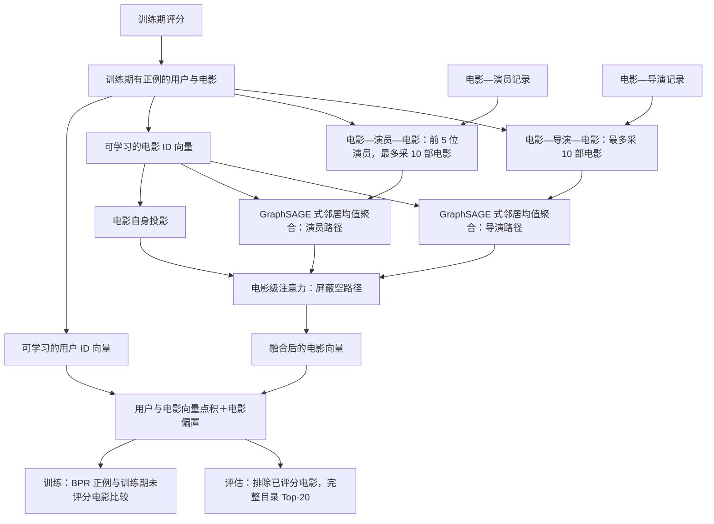

# HetRec 电影推荐：基于本科毕业论文思路的重新实现

[](https://github.com/zhuoqun-xu/hetrec-graph-recommender/actions/workflows/ci.yml)
[](https://www.python.org/)
[](LICENSE)

简体中文 · [English](README.md)

我把 2021 年本科毕业论文中的异构图表示思路，改造成一个电影 Top-20 推荐实验。这个仓库放了可运行的代码、实验规则和结果。

[英文研究摘要](PROJECT_ABSTRACT.md)

## 研究问题

用户评分告诉我们“谁喜欢什么电影”，演员和导演则提供另一种线索：两部电影可能没有多少共同观众，却由同一位导演执导。这个项目想看，加入这类关系后，推荐列表是否会更好。

我用两种比较来检验它：一是与只用评分的热门推荐、相似用户协同过滤和矩阵分解比较；二是把演员／导演关系随机打乱，再用**完全相同的图模型**训练。如果真实关系有价值，它至少应该比打乱后的关系更有用。当前版本没有观察到这样的优势。

## 数据与实验规则

数据集是 [HetRec 2011 MovieLens-2k v2](https://files.grouplens.org/datasets/hetrec2011/hetrec2011-movielens-2k-v2.zip)。它在电影评分之外，还提供演员、导演、类型等信息。这个模型使用评分、电影、演员和导演四类文件。原始数据需要自行下载，解压在仓库外；数据集 [README](https://files.grouplens.org/datasets/hetrec2011/hetrec2011-movielens-readme.txt)注明**非商业使用**条件，仓库不包含原始数据。

本仓库的 MIT 许可证仅适用于源代码和项目文档，不授予 HetRec 数据集、论文或其他第三方资源的使用权；详见[数据许可说明](DATA_LICENSE.md)。

评分按全局时间顺序分成训练、验证、测试三段，比例为 80/10/10。至少 4 星算喜欢；训练期喜欢过电影的用户和被喜欢过的电影，才进入这次“老用户推荐老电影”的评估。模型从完整候选电影目录中排序，而不是只从少量抽样电影中挑。推荐时，用户以前评过的电影一律排除，低评分也算“看过”。Recall@20 和 NDCG@20 都先对每位用户计算，再取平均。

数据里有一批评分时间早于电影表列年份。结果表使用[时间异常协议](06_时间异常敏感性协议_2026-09-15.md)：先固定原始时间切分，只根据**训练期评分**找出 376 部年份矛盾的电影，再从三段数据中移除。运行命令去掉清理开关，就能查看未清理版。

对照模型是热门推荐、50 邻居相似用户协同过滤和 BPR 矩阵分解。图模型还分别测试了打乱关系、只看电影自身、只看演员、只看导演，以及不使用学习式注意力。打乱关系时，保留每部电影原有的邻居数量和整体被采样次数，只随机换掉“谁与谁相连”；其余训练设置保持一致。主模型在验证集选训练轮数，测试结果取随机种子 42、43、44 的平均。

## 模型怎么工作

异构关系是 `用户—评分—电影—演员/导演—人物`。模型沿着 `电影—演员—电影` 和 `电影—导演—电影` 两条路径寻找相似电影。例如，两部电影有共同导演，就可以在导演路径下相连。类型路径连接的电影太多，这版没有使用。

1. 每部候选电影、每位训练用户各有一个可学习的 ID 向量。演员路径先保留每部电影排名前 5 的演员；每条路径再为每部电影最多采样 10 部其他候选电影，采样后在该随机种子内固定。
2. 模型分别取演员邻居和导演邻居的电影向量均值，与当前电影向量拼接、变换，得到两个关系分支。电影自身还有一个分支，所以没有邻居的电影也能打分。
3. 注意力为每部电影的“自身／演员／导演”三个可用分支分配权重。用户向量与融合后的电影向量做点积，再加电影偏置，得到推荐分数。
4. 训练时，每条至少 4 星的评分配一部该用户训练期未评分的电影，用 BPR 损失学习“喜欢的电影应排得更前”。未评分在这里只是采样对象，不代表用户不喜欢。

这版借鉴了 GraphSAGE 的邻居均值聚合和 HAN 的路径融合。电影与用户都使用可学习 ID 向量，因此评估范围是训练期出现过的用户和电影；演员／导演用于建关系，没有单独的节点向量。推荐打分与 BPR 训练是为这个任务增加的部分。

## 模型结构

演员和导演记录只负责找电影邻居。两条元路径分别聚合邻居，注意力再把它们与电影自身分支合成一个电影向量，用来排序。



## 算法细节

设 $S_p(m)$ 为电影 $m$ 在演员或导演路径 $p$ 下采到的邻居，$e_m$ 为电影 ID 向量。自身分支与非空关系分支的计算为：

$$h_{m,\mathrm{self}}=\operatorname{L2Norm}(\operatorname{ReLU}(W_{\mathrm{self}}e_m+b_{\mathrm{self}})),$$

$$\bar e_{m,p}=\frac{1}{|S_p(m)|}\sum_{n\in S_p(m)}e_n,\qquad h_{m,p}=\operatorname{L2Norm}(\operatorname{ReLU}(W_p[e_m\,\|\,\bar e_{m,p}]+b_p)).$$

注意力网络为自身、演员、导演三个分支分别计算 $a_{m,p}=w^{\mathsf T}\tanh(W_a h_{m,p}+b_a)+c_a$，只对可用分支做 softmax，得到 $\alpha_{m,p}$。融合向量为 $z_m=\sum_p\alpha_{m,p}h_{m,p}$，用户 $u$ 对电影 $m$ 的分数是 $s(u,m)=e_u^{\mathsf T}z_m+c_m$。注意力是在分支之间分配权重，不是逐个邻居打权重。

对训练正例 $(u,m^+)$ 和抽样的未评分电影 $m^-$，损失为：

$$L=\frac{1}{|D|}\sum_{(u,m^+,m^-)\in D}\operatorname{softplus}(s(u,m^-)-s(u,m^+)).$$

对应代码：[数据切分与评估](data_protocol.py) → [关系采样](graph_data.py) → [电影编码与打分](meta_path_model.py) → [训练与消融](run_meta_path_recommender.py)。

## 本地运行

使用 Python 3.11 或更新版本；先用 `python3 --version` 确认指向正确的版本。把命令里的 `/path/to/hetrec2011-movielens-2k-v2` 换成数据解压目录。下面的虚拟环境命令适用于 macOS／Linux。

```sh
python3 -m venv .venv
.venv/bin/python -m pip install -r requirements.txt
.venv/bin/python -B -m unittest discover -v
.venv/bin/python -B run_popularity_baseline.py /path/to/hetrec2011-movielens-2k-v2 --exclude-train-year-contradictions
.venv/bin/python -B run_user_cf_baseline.py /path/to/hetrec2011-movielens-2k-v2 --exclude-train-year-contradictions
.venv/bin/python -B run_bpr_mf_baseline.py /path/to/hetrec2011-movielens-2k-v2 --exclude-train-year-contradictions
.venv/bin/python -B run_meta_path_recommender.py /path/to/hetrec2011-movielens-2k-v2 --exclude-train-year-contradictions
```

每个程序会输出一份 JSON 汇总报告。去掉 `--exclude-train-year-contradictions` 可运行未清理版。测试环境为 Python 3.12.14、NumPy 2.3.5、pandas 2.2.3、PyTorch 2.14.0；CPU 上跑完图模型及五个内部版本、每版三个种子，约用 **358 秒**。内存峰值尚未测量。

也可以用 `make` 运行相同流程：

```sh
make test
make audit DATA_DIR=/path/to/hetrec2011-movielens-2k-v2
make experiment DATA_DIR=/path/to/hetrec2011-movielens-2k-v2
```

`make experiment` 会依次运行清理协议下的三个基线和图实验，结果输出到标准输出，不会复制或修改原始数据。

## 结果

清理后的测试集有 **522 位可评估用户、6,609 条正向评分和 7,498 部候选电影**。图模型和 BPR-MF 的数值是三个种子的平均。Recall@20 看每位用户后来喜欢的电影有多少进入前 20；NDCG@20 还考虑命中电影的排名。

| 方法 | Recall@20 | NDCG@20 |
| --- | ---: | ---: |
| 热门推荐 | 0.099504 | 0.094369 |
| 相似用户协同过滤 | **0.115075** | **0.114766** |
| BPR 矩阵分解 | 0.095110 | 0.097202 |
| 真实演员＋导演关系图 | 0.088159 | 0.088704 |
| 打乱关系终点的同预算图 | 0.091457 | 0.092014 |

这次相似用户协同过滤排在第一。真实演员／导演关系图比打乱关系后的图还低一些，当前的建图和融合方式没有带来推荐增益。BPR-MF 训练轮数较短，和图模型的训练预算并不完全相同。

图模型先跑了较短的训练轮数，看过测试成绩后才继续延长训练。因此表中图模型的结果属于后续探索，不是一次全新盲测。各个种子的分数、路径消融和数据清理规则，见[时间异常协议](06_时间异常敏感性协议_2026-09-15.md)及[完整实验报告](07_异构图实现与实验结果_2026-09-15.md)。

## 参考论文

- Hamilton、Ying 与 Leskovec（2017），[*Inductive Representation Learning on Large Graphs*](https://arxiv.org/abs/1706.02216)：邻居采样和均值聚合（GraphSAGE）。
- Wang 等（2019），[*Heterogeneous Graph Attention Network*](https://arxiv.org/abs/1903.07293)：按元路径融合异构信息（HAN）。
- Rendle 等（2009），[*BPR: Bayesian Personalized Ranking from Implicit Feedback*](https://www.auai.org/uai2009/papers/UAI2009_0139_48141db02b9f0b02bc7158819ebfa2c7.pdf)：成对排序损失。
- Wang 等（2019），[*Knowledge Graph Convolutional Networks for Recommender Systems*](https://arxiv.org/abs/1904.12575)：在推荐中利用物品侧关系的相关工作。
- Ji 等（2023），[*A Critical Study on Data Leakage in Recommender System Offline Evaluation*](https://arxiv.org/abs/2010.11060)：离线推荐评估中的时间切分与信息泄漏问题。
- Harper 与 Konstan（2015），[*The MovieLens Datasets: History and Context*](https://files.grouplens.org/papers/harper-tiis2015.pdf)；Cantador、Brusilovsky 与 Kuflik（2011），[*Second Workshop on Information Heterogeneity and Fusion in Recommender Systems (HetRec2011)*](https://doi.org/10.1145/2043932.2044016)：MovieLens 与 HetRec 数据集背景。

## 局限

电影元数据是在部分评分时间之后整理的，可能带有后见信息；年份异常清理不能解决所有时间问题。演员和导演目前只用于连接电影，没有自己的向量。每条路径最多采 10 个邻居，导演路径还比较稀疏。这版只评估训练期出现过的用户和电影；对于新用户或新电影，模型没有可用的 ID 向量。BPR-MF 训练预算较短，实验也只有一次时间切分和三个随机种子。
